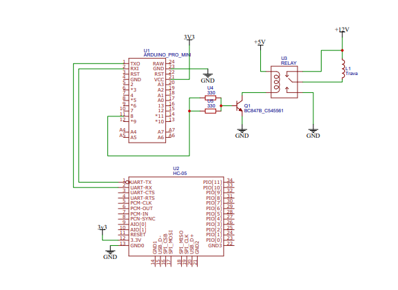

# TravaBluethoot

Projetinho que criei ano passado
Consiste em uma comunicação basica entre um modulo bluethoot HC-05 e um arduino pro mini, que é responsavel por ativar o relé que abre a tranca.

Segue no Repositorio o projeto no platformIO juntamete com o esquematico da mesma

